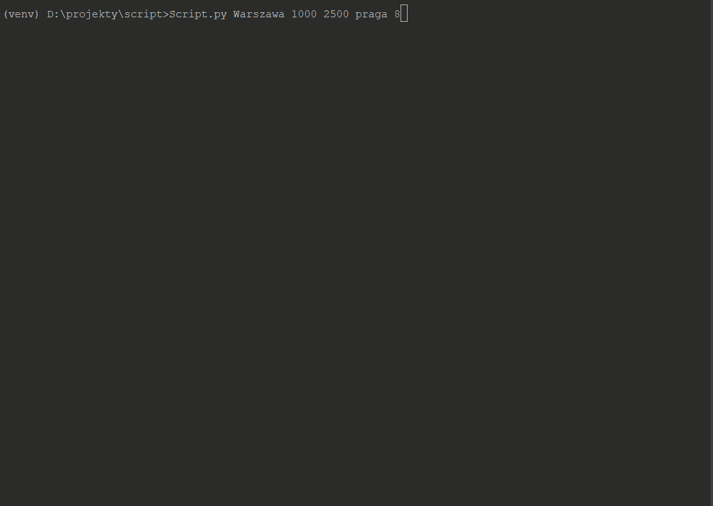

# Looking for an apartment.
###### Web Scraping (with [BeautifulSoup][bslink])
The other day my friend asked me to help him with finding a new apartment.
That’s how this script came into existence. 

The script finds links to the apartments according to your guidelines.

It works in Poland and supports websites such as:
* Otodom
* Olx

but it's fully ready to add more websites in future.

Your input should contain:
* Name of city  
* Lower limit
* Upper limit
* District (this one can be omitted - just write none)
* Search buffer [You can change size of buffer(1-500)]

**Example**:
```
Script.py warszawa 1000 3000 praga 50
```

The Script also creates JSON file with search results.

###
All additional extensions and packages can be found in 'requirements.txt'.

### Concurrent version
This branch contain concurrent version which decrease the runtime.
I made use of asyncio library and async/await keywords added in Python 3.5.
As a result, the boost of efficiency is insane. 
###
The execution times of simple call with search buffer set on 100 are:
* classic - 203 seconds
* concurrent - 53 seconds

###


[bslink]:https://www.crummy.com/software/BeautifulSoup/bs4/doc/